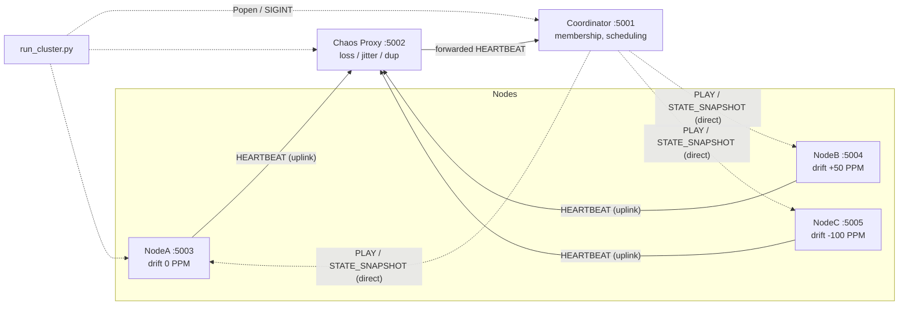
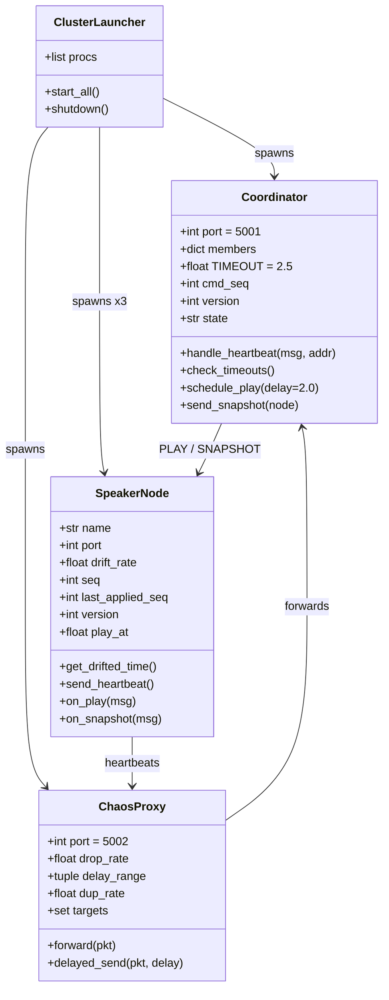
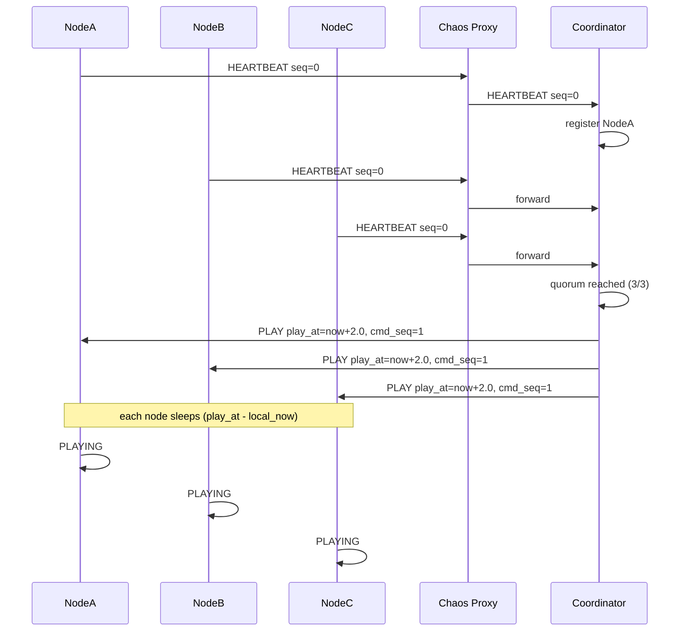
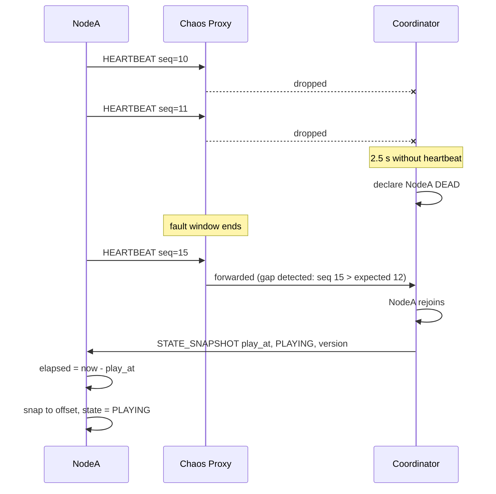
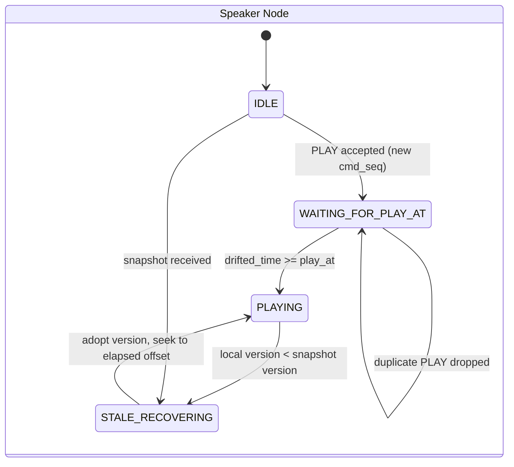
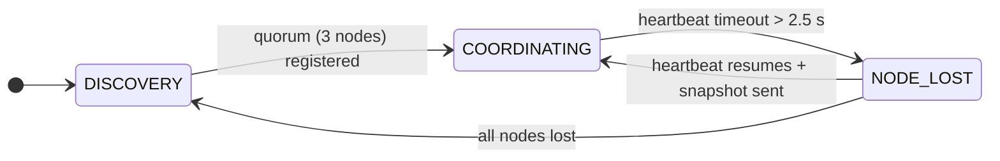

# Speaker Gremlins: Engineering Distributed Playback Synchronization and Fault Tolerance over Unreliable Networks

*Final Project Report: Distributed Systems*

---

## 1. Executive Summary & Problem Formulation

**Motivation.** Keeping several devices playing the same audio at the same instant looks trivial on a whiteboard and is brutal in practice. Packets are lost, delayed, duplicated and reordered; every device's oscillator ticks at a slightly different rate; and a node that goes quiet cannot tell you why. There is no shared clock and no reliable channel, so "agreement" has to be engineered from unreliable parts.

**Core question.** *When multiple independent processes try to agree on shared state over an unreliable network, what actually breaks, how do you detect it, and how do you recover?*

**Approach.** *Speaker Gremlins* is a cluster of independent OS processes, simulating networked speakers, that tries to stay in sync through a deliberately degraded network. It is built only on the Python standard library (`socket`, `time`, `json`, `subprocess`, `argparse`, `threading`), with no dependencies, so the raw OS networking and the distributed-systems failure modes stay visible.

**Scope.** This is *not* a DSP project. No audio is decoded or rendered; "playback" is a state (`play_at`, `playback_state`, `version`). The goal is to make packet loss, latency jitter, clock drift, partitions and split-brain/stale state *visible, tangible and solvable*.

**Headline findings.**

| Experiment | Failure mode | Mechanism that fixed or bounded it |
|---|---|---|
| A: Silence Problem | Slow looks identical to dead | Timeout tuning (a trade-off, not a fix) |
| B: Duplicate Commands | At-least-once delivery re-executes commands | Idempotency via `cmd_seq` / `last_applied_seq` |
| C: Returning Stranger | Conflicting worldviews after partition | Monotonic `version` (epoch-style ordering) |

---

## 2. System Architecture & Wire Protocol Specification

### 2.1 Components

| Component | File / Port | Responsibility |
|---|---|---|
| **Coordinator** | `src/coordinator.py` / UDP 5001 | Membership registry, heartbeat failure detection (2.5 s), clock-skew calculation, `play_at` scheduling, `STATE_SNAPSHOT` broadcast |
| **Chaos Proxy** | `src/chaos_proxy.py` / UDP 5002 | Transparent man-in-the-middle for node→coordinator traffic; injects loss, random delay/jitter, duplication and node-targeted faults |
| **Speaker Nodes** | `src/speaker_node.py` / 5003 (NodeA, 0 PPM), 5004 (NodeB, +50 PPM), 5005 (NodeC, −100 PPM) | Emit heartbeats, simulate oscillator drift, wait for `play_at`, apply snapshots |
| **Orchestrator** | `run_cluster.py` | `subprocess.Popen` lifecycle, staggered socket binding, centralized SIGINT shutdown |

### 2.2 Asymmetric routing

Uplink traffic (heartbeats) takes the hostile path; downlink (commands, snapshots) goes direct. This isolates the *detection* problem (what the coordinator can observe) from the *delivery* problem, and keeps experiments reproducible.

```
Node ──HEARTBEAT──► Chaos Proxy :5002 ──► Coordinator :5001
Node ◄──PLAY / STATE_SNAPSHOT───────────── Coordinator   (direct)
```

### 2.3 Wire protocol (JSON over UDP datagrams)

```json
{"type":"HEARTBEAT","node":"NodeA","seq":42,"sender_ts":1730900000.123,"port":5003}
{"type":"PLAY","sender_ts":1730900000.500,"play_at":1730900002.500,"cmd_seq":1,"version":1}
{"type":"STATE_SNAPSHOT","play_at":1730900002.500,"playback_state":"PLAYING","version":1}
```

| Message | Fields | Direction | Purpose |
|---|---|---|---|
| `HEARTBEAT` | `type, node, seq, sender_ts, port` | Node → Proxy → Coordinator | Liveness, registration, gap detection via `seq` |
| `PLAY` | `type, sender_ts, play_at, cmd_seq, version` | Coordinator → Nodes | Scheduled start, deduplicated by `cmd_seq` |
| `STATE_SNAPSHOT` | `type, play_at, playback_state, version` | Coordinator → Node | Full-state recovery |

The `port` field in `HEARTBEAT` is needed because the proxy rewrites the source address; the coordinator must know where to reply.

### 2.4 Architectural Decision Log

| Decision | Choice | Rationale |
|---|---|---|
| Processes vs. threads/objects | **Separate OS processes** | Real address-space and network boundaries; no shared memory to cheat with; crashes are real (`kill`) |
| Transport | **UDP (`SOCK_DGRAM`)** | TCP would hide loss behind kernel retransmission and add head-of-line blocking; UDP exposes true loss, reordering and jitter to the application |
| Synchronization style | **Push** (coordinator sends snapshots on rejoin) vs. pull | Push reacts at the moment recovery is known; pull costs polling traffic and delays convergence. Cost: coordinator needs reliable knowledge of the rejoin |
| Command timing | **Future timestamp `play_at = now + 2.0 s`** vs. "PLAY NOW" | "Now" means each node starts at *arrival time*, so jitter becomes desynchronization. A future timestamp turns variable delay into slack: every node that receives the packet in time starts at the same target instant |

---

## 3. Visual Specifications & Diagrams

### 3.1 System topology & network flow



### 3.2 Component & class/module diagram



### 3.3 Sequence: normal operation



### 3.4 Sequence: fault injection & recovery



### 3.5 State machines





---

## 4. Milestone Implementation Log

### Milestone 0: Raw sockets & process boundaries
**Concept.** Two processes exchange a datagram over loopback. **Challenge.** `bind()` failures (`Address already in use`), launch ordering, and understanding that UDP `sendto` succeeds even if nobody is listening.
```python
sock = socket.socket(socket.AF_INET, socket.SOCK_DGRAM)
sock.bind(("127.0.0.1", 5001))
data, addr = sock.recvfrom(4096)
```
**Observed.** Receiver prints the payload and sender address; sending to an unbound port silently vanishes, which is the first lesson in UDP's lack of feedback.

### Milestone 1: Structured wire format & latency logging
**Concept.** Replace raw strings with JSON carrying `seq` and `sender_ts`. **Challenge.** Which clock? `time.time()` (wall clock) is comparable across processes but can jump (NTP step, manual change); `time.monotonic()` never goes backward but has an arbitrary per-process origin and is not comparable across machines. **Solution.** Wall clock for cross-process timestamps (`sender_ts`, `play_at`), monotonic for local durations and timeouts.
```python
msg = {"type": "HEARTBEAT", "node": name, "seq": seq, "sender_ts": time.time(), "port": port}
sock.sendto(json.dumps(msg).encode(), proxy_addr)
# receiver
delta_ms = (time.time() - msg["sender_ts"]) * 1000
```
**Observed.** On loopback the timing error is sub-millisecond: the first heartbeats logged `Error: -0.4ms` (NodeA), `-0.3ms` (NodeB) and `-0.5ms` (NodeC). This is only meaningful because sender and receiver share one physical clock; across real hosts it would include clock offset.

### Milestone 2: Multi-node clustering & heartbeat failure detection
**Concept.** A dynamic membership registry keyed by node name, with `last_seen` stamped by the monotonic clock. **Challenge.** Detecting a *silent* crash: no FIN, no error, just absence.
```python
members[msg["node"]] = {"addr": ("127.0.0.1", msg["port"]), "last_seen": time.monotonic()}
for name, m in members.items():
    if time.monotonic() - m["last_seen"] > 2.5:
        declare_dead(name)
```
**Observed.** Killing NodeB's process yields a `DEAD` declaration about 2.5 s later. The timeout is a policy, not a fact.

### Milestone 3: Fault injection with the chaos proxy & packet-loss detection
**Concept.** A transparent proxy on `:5002` drops packets with probability 20–50 % (configurable), optionally per node.
```python
if random.random() < drop_rate:
    log("DROP", msg); continue
sock.sendto(data, coordinator_addr)
```
**Detection.** The coordinator tracks the next expected `seq` per node; `seq > expected` reveals `seq - expected` lost heartbeats.
**Observed.** Gap logs appear at roughly the configured rate. At the upper end, drops of several consecutive heartbeats approach the 2.5 s window and cause flapping, an early hint of Experiment A.

### Milestone 4: Latency, jitter & absolute-timestamp scheduling
**Challenge.** A proxy that `sleep()`s in its receive loop serializes everything and *adds* head-of-line blocking. **Solution.** Each packet gets its own delay via `threading.Timer`/worker thread, so forwarding is non-blocking and reorders naturally.
```python
delay = random.uniform(lo, hi)
threading.Timer(delay, lambda: sock.sendto(data, coordinator_addr)).start()
```
**Scheduling.** Instead of "PLAY NOW", the coordinator sends `play_at = now + 2.0`. A node computes `wait = play_at - now` and sleeps; if the packet's transit time is under 2.0 s the start is simultaneous regardless of jitter. Packets that arrive *after* `play_at` are the failure case (handled by snapshots later).

### Milestone 5: Clock drift simulation
**Concept.** Real crystal oscillators run off-nominal by tens of PPM. Each node scales its local elapsed time:
```python
def get_drifted_time(self):
    elapsed_mono = time.monotonic() - self.start_mono
    return self.start_real + elapsed_mono * (1 + self.drift_rate)
```
NodeB: `+50e-6`, NodeC: `-100e-6`.
**Observed (measured, ~22 s run; see §4.9).** Each heartbeat logs `[Node] Expected | Local | Error`. NodeA's error stays flat near −0.4 ms, NodeB's climbs from −0.3 ms to +0.6 ms, and NodeC's falls from −0.5 ms to −2.6 ms. The slopes match the configured drift rates, so the divergence is linear in time. Projected, the 150 PPM relative skew between B and C is about 0.15 ms per second, 9 ms per minute and roughly 0.54 s per hour. That is invisible in a short demo and audible in a long session. Real causes are temperature, crystal aging and manufacturing tolerance, which is why periodic resynchronization is necessary.

### Milestone 6: Node rejoin & state snapshot recovery
**Challenge.** A returning node missed `PLAY`. Two designs exist: replay the missed event log, or send current state. Snapshots win here because state is tiny and replays require retained history and ordering guarantees.
```python
# coordinator, on rejoin
send(node, {"type": "STATE_SNAPSHOT", "play_at": play_at,
            "playback_state": "PLAYING", "version": version})
# node
elapsed = time.time() - msg["play_at"]      # seek position into the track
```
**Observed.** The node jumps in at `elapsed` seconds instead of restarting from zero.

### Cluster orchestration
`run_cluster.py` launches the coordinator, proxy and three nodes with `subprocess.Popen`, sleeping briefly between launches so sockets bind before their first peer sends. On `KeyboardInterrupt` it calls `terminate()` on each child and `wait()`s, preventing orphaned processes holding ports.

---

### 4.9 Baseline run: measured results (no faults)

**Setup.** `python run_cluster.py` on Windows for about 22 s, with the proxy at its defaults (`Drop: 0%, Max Delay: 0ms, Target: ALL`). This is the control against which the fault experiments in §5 are compared.

**Startup and scheduling (excerpt).**
```
I'M ALIVE! Node: NodeA   ...  [NodeA] Expected: 1791308717.832 | Error: -0.4ms
I'M ALIVE! Node: NodeB   ...  [NodeB] Expected: 1791308718.037 | Error: -0.3ms
I'M ALIVE! Node: NodeC   ...  [NodeC] Expected: 1791308718.242 | Error: -0.5ms
Sent PLAY command to nodes, scheduled for: 1791308720.242
[NodeB] PLAYING NOW! Local time: 1791308720.242
[NodeC] PLAYING NOW! Local time: 1791308720.242
[NodeA] PLAYING NOW! Local time: 1791308720.243
```
- The nodes registered about 205 ms apart (staggered launch). Quorum was reached at `…718.242`, and `play_at = 718.242 + 2.0 = 720.242`, exactly the future-timestamp rule from Milestone 4.
- All three nodes received `PLAY` for the same instant (`1791308720.2421417`) and began playing within **1 ms** of each other (`.242`, `.242`, `.243`; the log's resolution is 1 ms). A 2 s lead absorbed the startup and wake-up variance.

**Drift, measured.** Error is `Local − Expected` at each heartbeat:

| Node | Configured drift | Error at start | Error at end (~21 s later) | Change | Implied drift |
|---|---|---|---|---|---|
| NodeA | 0 PPM | −0.4 ms | −0.4 ms | ≈ 0 | ≈ 0 PPM |
| NodeB | +50 PPM | −0.3 ms | +0.6 ms | +0.9 ms (predicted 1.07) | ≈ 42 PPM |
| NodeC | −100 PPM | −0.5 ms | −2.6 ms | −2.1 ms (predicted 2.1) | ≈ 99 PPM |

- NodeC's change matches its prediction almost exactly. NodeB's implied rate is slightly under 50 PPM, within the ±0.1 ms print resolution plus a small constant offset.
- NodeA's small constant offset of about −0.4 ms is a measurement baseline (the gap between taking the reference timestamp and reading the local clock), not drift. Drift is therefore best read as the *slope*, not the absolute value.
- By the end of the run B and C had separated by about 3.2 ms (+0.6 vs −2.6), consistent with a 150 PPM relative skew over 21 s. Nothing in the protocol corrects this yet; it simply grows. Hence the skew-compensation work in §7.

**Heartbeat behaviour.** Heartbeats arrive at a nominal 0.5 s interval; observed gaps cluster at ~0.50 s and ~0.515 s (for example `721.249 → 721.764 → 722.280`). The ~15 ms jitter is likely Windows timer granularity (about 15.6 ms), not network delay, since the proxy added none. Every heartbeat was forwarded (`No delay or drop`), with roughly 44 per node and zero sequence gaps. So any gap, late packet or false `DEAD` in §5 is attributable to the injected faults.

---

## 5. Empirical Experiments & Critical Observations

### Experiment A: The Silence Problem (dead vs. slow)
- **Setup.** Proxy delay 1.0–3.5 s on uplink traffic versus actually terminating NodeA's process.
- **Finding.** From the coordinator's point of view the two are indistinguishable: no packet has arrived. In an asynchronous network there is no bound on delay, so no timeout can be both complete and accurate.
- **Observed.** Under high jitter the coordinator declared the *healthy* NodeA dead after 2.5 s. When the delayed heartbeats finally landed, it treated NodeA as rejoining and pushed a `STATE_SNAPSHOT`. NodeA, which was playing correctly, was forced to seek, causing skips/stutters. Delayed packets also arrived out of order, so a late older `seq` could be misread as a gap or reset.
- **Trade-off.**

| Timeout | Detection speed | False positives |
|---|---|---|
| Short (e.g. 1 s) | Fast | High under jitter |
| 2.5 s (used) | Moderate | Fails when jitter tail > 2.5 s |
| Long (e.g. 10 s) | Slow | Low, but a real crash goes unnoticed longer |

Production systems use adaptive detectors (e.g. φ-accrual) that output a suspicion level rather than a binary verdict.

### Experiment B: The Duplicate Command problem
- **Setup.** Proxy duplicates `PLAY` datagrams.
- **Finding.** Networks give at-least-once delivery at best. Without idempotency, a duplicated `PLAY` restarts the countdown or replays the command, desynchronizing nodes.
- **Implementation.** The coordinator stamps a monotonic `cmd_seq`; each node stores `last_applied_seq` and ignores anything `<=`.
```python
if msg["cmd_seq"] <= self.last_applied_seq:
    log(f"Drop redundant PLAY command (seq {msg['cmd_seq']})"); return
self.last_applied_seq = msg["cmd_seq"]
```
- **Observed.** Logs show `Drop redundant PLAY command (seq 1)` and playback continues without interruption. The command became idempotent without needing acknowledgements.

### Experiment C: The Returning Stranger (conflicting worldviews)
- **Setup.** NodeA isolated by an 85 % drop rate while the coordinator advanced the track `version` 1 → 2.
- **Finding.** A node that rejoins holds a *different* picture of the world. Reconciliation needs a deterministic rule that every party applies identically.
- **Implementation.** Monotonic `version`; the higher always wins.
- **Observed.**
  - `Local version 1 is stale! Adopting coordinator version 2`, so the node resynced.
  - If the coordinator restarts with wiped state (`version = 0`), nodes refuse the downgrade (`Local version >= incoming version`), preventing a restarted coordinator from rolling the cluster backward. (The downside: the cluster is now *stuck ahead* of an amnesiac coordinator, so versions must be persisted.)
- **Connection to Raft/Paxos.** Raft *terms* and Paxos *ballot numbers* are the same idea: a monotonically increasing epoch fences stale leaders and resolves split-brain, since any message from an older epoch is rejected on sight.

---

## 6. Theoretical Synthesis & Lessons Learned

**Synchronous vs. asynchronous models & FLP.** A synchronous model assumes known bounds on delay and clock rate; failure detection is then trivial. Real networks are asynchronous (or at best partially synchronous). The FLP result shows that in a purely asynchronous system, even one crash fault makes deterministic consensus impossible, because a slow process cannot be told from a dead one. That is Experiment A as a theorem. Practical systems sidestep it with timeouts (partial synchrony) and randomization, accepting occasional wrong suspicions.

**Physical vs. logical time.** Wall clocks jump (NTP steps, manual changes, leap seconds); monotonic clocks never regress but are meaningless across machines; Lamport and vector clocks sidestep physical time and capture causal order only. Our project uses wall time for `play_at` (a *physical* deadline is required for audio) and monotonic time for local timeouts. Our `version`/`cmd_seq` counters are logical clocks in spirit.

**Delivery semantics & idempotency.** At-most-once loses messages, at-least-once duplicates them, and exactly-once is only achievable as *at-least-once plus idempotent receivers*. Sequence numbers are the cheapest idempotency token.

**State transfer vs. operation transfer.**

| | Snapshots (state transfer) | Event log (operation transfer) |
|---|---|---|
| Size | Constant | Grows with history |
| Recovery | One message | Needs retained, ordered log |
| Fidelity | Loses history | Full audit trail |
| Used here | Yes (state is tiny) | No |

**SPOF vs. consensus.** The single coordinator is simple and fast but a single point of failure: it is the sole source of `play_at`, `version` and membership truth. Replicated consensus (Raft/Paxos) removes the SPOF at the price of quorum latency and implementation complexity.

---

## 7. Future Work & Engineering Horizons

1. **Leader election.** Add the Bully algorithm as a first step, then Raft-style terms, heartbeats and log replication, so the coordinator is no longer a SPOF and the `version` field becomes a true term.
2. **Real clock synchronization.** Implement NTP-style four-timestamp exchange: with `t0..t3`, `offset = ((t1−t0)+(t2−t3))/2` and `delay = (t3−t0)−(t2−t1)`; filter by minimum-RTT samples. Consider PTP-style hardware timestamping concepts for sub-millisecond targets.
3. **Adaptive playback.** Replace hard snap-seeks with skew compensation: a slightly faster or slower playback rate (e.g. ±0.5 %) to slew toward the reference clock inaudibly, with hard jumps reserved for large errors.
4. **Better failure detection.** Replace the fixed 2.5 s threshold with a φ-accrual detector, and add acknowledgements/retry for `PLAY`.
5. **Persistence.** Durably store coordinator `version` and `cmd_seq` so restarts never present as downgrades.

---

*End of report.*
